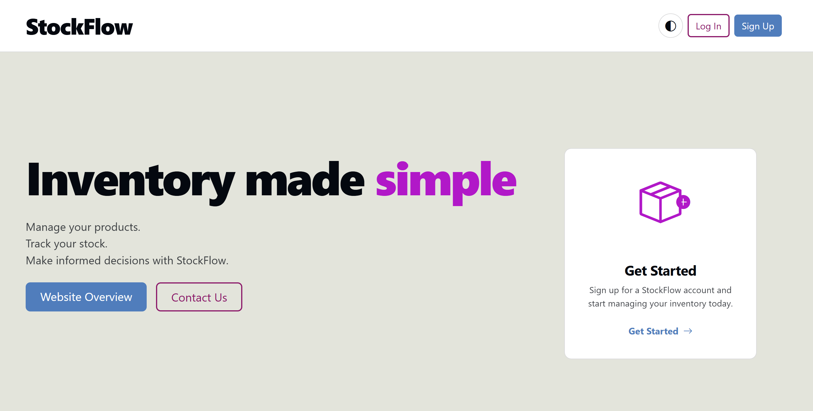
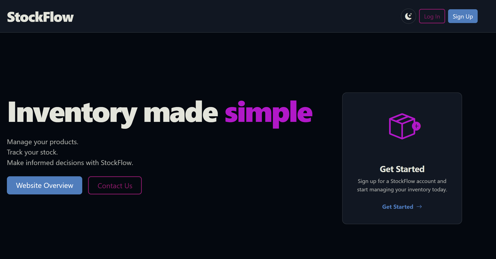
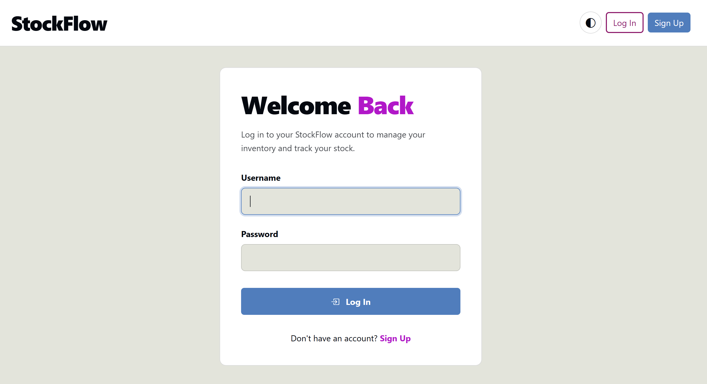
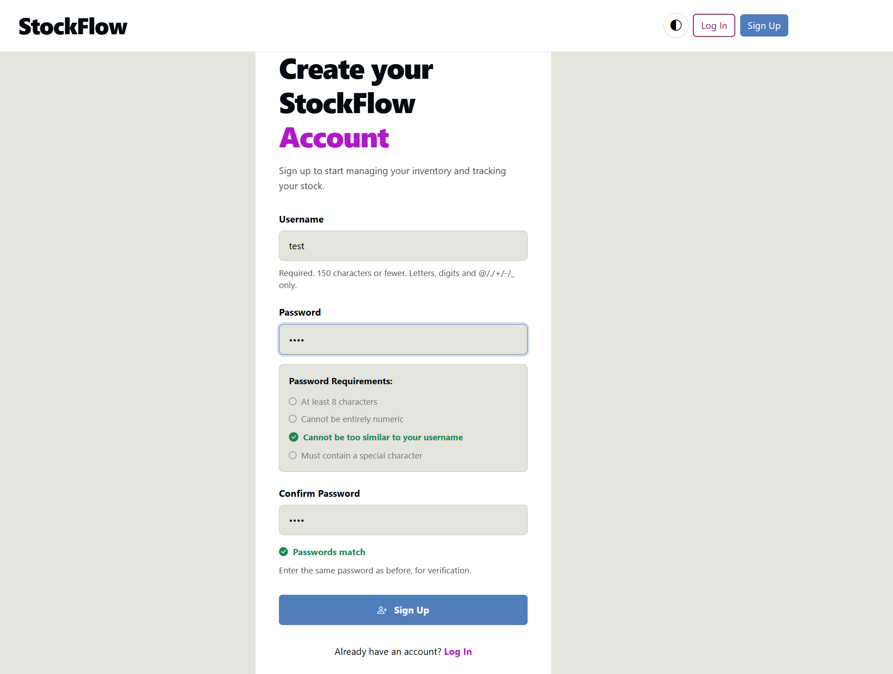
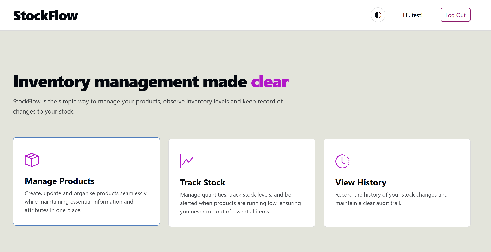
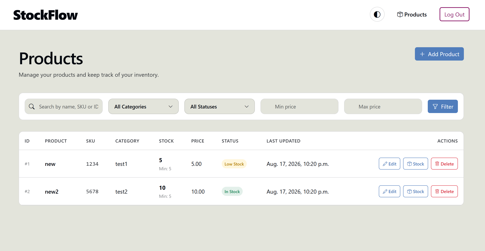
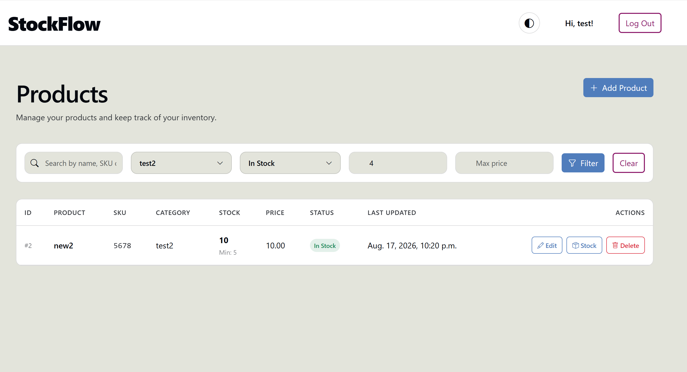
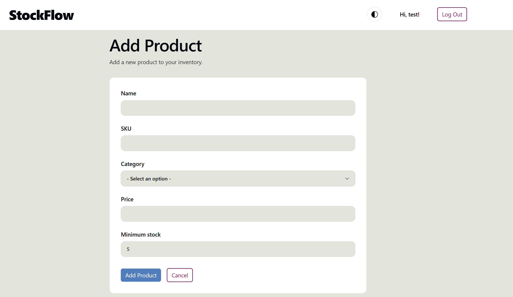
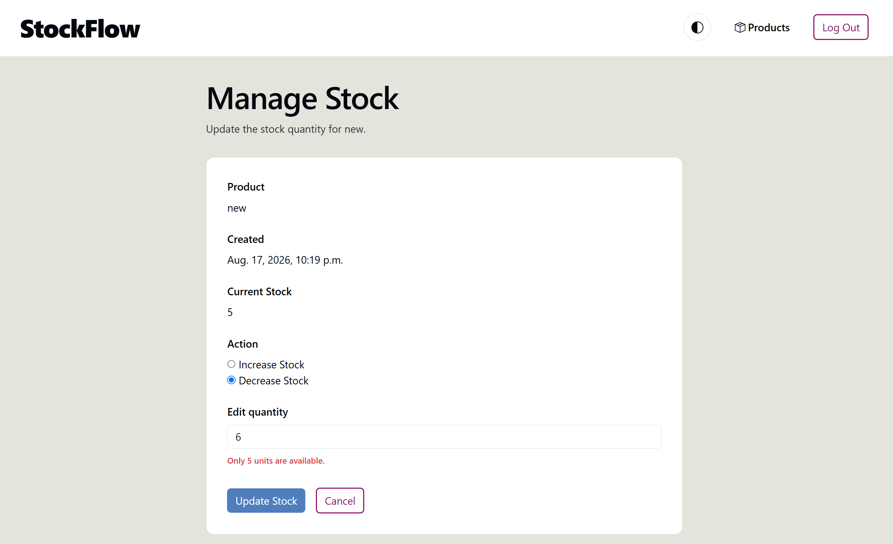
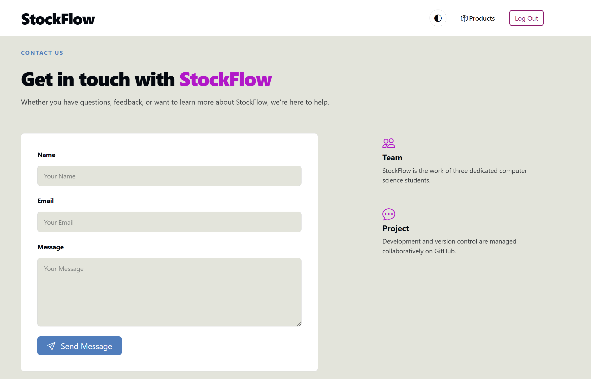

# StockFlow

A simple stock management web app built with Django. Lets you track products, categories, and stock movements, with warnings for low or out-of-stock items.

**Repo:** https://github.com/ariful-riane/stockflow

---

## Features

- **Home page** — landing page introducing StockFlow
- **Accounts** — user registration, login, logout, and pages restricted to logged-in users
- **Dashboard** — total products, items in stock, low-stock and out-of-stock counts
- **Products** — add, edit, delete, search, and filter, with fields for name, SKU, category, quantity, price, and minimum stock level
- **Stock movements** — record stock in/out, with a history of who changed what and when
- **Validation** — stock quantity can't go below zero
- **Light/dark theme** — toggle between light and dark UI
- **Contact page** — get-in-touch form

## Tech stack

- Python / Django
- SQLite (Django's default, bundled — no separate install needed)
- HTML, CSS, JS

## Project structure

```
stockflow/
├── inventory/        # products, categories, stock movement models & logic
├── stockmanager/     # Django project settings, urls
├── screenshots/       # README screenshots
├── manage.py
└── requirements.txt
```

## Getting started

**Prerequisites:** Python 3.12+ (required by Django 6.1) and pip installed.

```bash
# 1. Clone the repo
git clone https://github.com/ariful-riane/stockflow.git
cd stockflow

# 2. Create and activate a virtual environment
python -m venv venv
source venv/bin/activate      # Windows: venv\Scripts\activate

# 3. Install dependencies
pip install -r requirements.txt

# 4. Apply migrations
python manage.py migrate

# 5. (Optional) create an admin account
python manage.py createsuperuser

# 6. Run the dev server
python manage.py runserver
```

Then visit `http://127.0.0.1:8000/` in your browser. Register an account to access the dashboard and product pages.

## Team

This project was built as a team of three, split by feature area:

| Member | Focus | Responsibilities |
|---|---|---|
| **Methul** | Inventory backend | Product, Category, and StockMovement models; stock-in/stock-out logic; preventing negative stock; dashboard totals and low-stock warnings; testing; migrations; Django admin |
| **Joel** | Product pages & UI | Base layout and navigation; product list; add/edit/delete pages; CSS and JS, including light/dark theme; responsive design |
| **Riane** | Accounts, dashboard & quality | Login and signup forms with validation; search and filtering; add stock page; protecting pages from logged-out users; testing, sample data, deployment, README, screenshots |

## Status

Core features (auth, product CRUD, stock movement tracking, dashboard warnings) are implemented and working in the demo above. This is a student/learning project, so expect some rough edges.

## Screenshots

### Home page


### Dark theme


### Login


### Sign up


### Dashboard overview


### Product list


### Filtering


### Add product


### Manage stock


### Contact us
